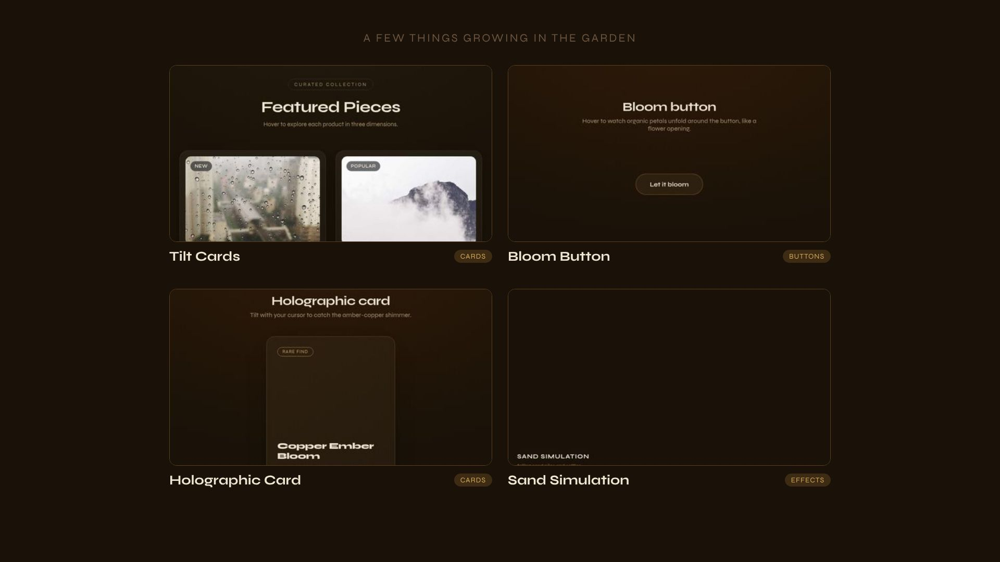
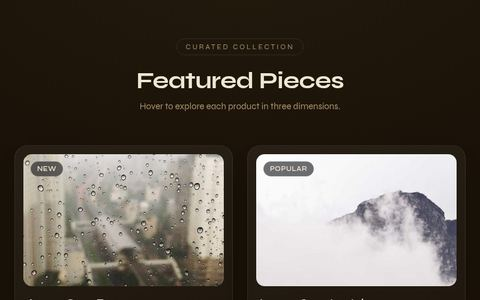
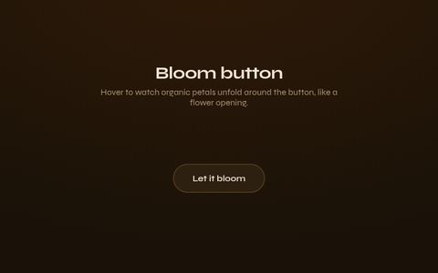
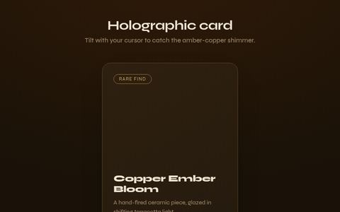
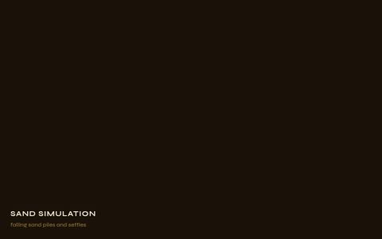
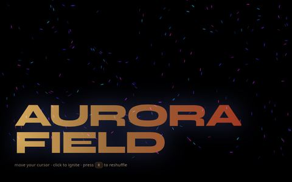
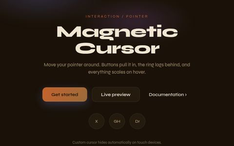
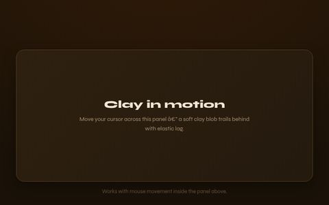
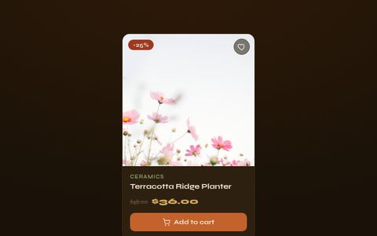

<div align="center">
  

  <h1>ArnieJS 🌱</h1>
  <p><strong>280+ vanilla JS components. Grown from scratch. No deps.</strong></p>

  
  
  

  <p><a href="https://marcozorn.github.io/arniejs/gallery.html"><strong>Browse the gallery →</strong></a></p>
</div>

---

<div align="center">
  <a href="https://raw.githubusercontent.com/MarcoZorn/arniejs/main/docs/assets/arniejs-intro.mp4">
    
  </a>
  <p><a href="https://raw.githubusercontent.com/MarcoZorn/arniejs/main/docs/assets/arniejs-intro.mp4">▶ Watch the 30s intro</a> · <a href="https://raw.githubusercontent.com/MarcoZorn/arniejs/main/docs/assets/arniejs-short.mp4">📱 Vertical cut (15s)</a></p>
</div>

Arnie never installed npm. Never will. He grows tomatoes and buttons the same way — from scratch, no shortcuts, no chemicals.
His neighbour's framework has 340 peer dependencies. Arnie's has zero.

## What's inside

| Category | Count | Examples |
|---|---|---|
| 🌿 Buttons | 10 | bloom, ember glow, seed burst |
| 🪵 Cards | 15 | parchment, field notes, bark texture |
| 🌾 Navigation | 10 | grove menu, root tab bar, floating dock |
| 🌍 Forms | 15 | harvest datepicker, clay color picker |
| 🌱 Loaders | 10 | sprout loader, soil skeleton, sun timer |
| 📊 Data display | 10 | grove bar chart, growth heatmap |
| 💬 Overlays | 10 | root drawer, ember snackbar |
| 🍂 Layout | 10 | bloom reveal, soil parallax |
| 🛒 E-commerce | 15 | product-card, cart-drawer, checkout-stepper |
| 📈 SaaS / dashboard | 15 | metric-card, activity-feed, api-key-display |
| ✍️ Blog / content | 10 | article-card, code-block, table-of-contents |
| 🖼️ Portfolio / agency | 10 | case-study-card, testimonial-rotator |
| 🔧 Utility | 20 | cookie-consent, focus-trap, json-viewer |
| 🎉 Fun / opinionated | 30 | blob-cursor, draggable-window, lunar-clock |
| ✨ Misc + originals | 50 | soil scramble, kanban board, magnetic cursor |
| 🌌 Visual effects | 41 | sand simulation, gravity seeds, clay voronoi |

**280+ components total.** Full searchable list, live previews, and code → **[marcozorn.github.io/arniejs/gallery.html](https://marcozorn.github.io/arniejs/gallery.html)**

## The AI slop problem

Every AI coding assistant defaults to the same 12 components.
Same shadcn button. Same Tailwind card. Same Inter font.
Every site looks like it was generated by the same LLM.
(Because it was.)

ArnieJS gives your AI something better to reach for.
Add it to your CLAUDE.md, your Cursor rules, your Codex config —
and watch the output stop looking like a template.

```bash
npx arniejs-cli add [anything]
```

Zero dependencies. Instantly different. Full agent-integration guide (Claude Code, Codex, Cursor, Gemini CLI, and more) → **[docs.html](https://marcozorn.github.io/arniejs/docs.html#ai-agents)**

## Using with AI agents

Point any agent that can read files or run shell commands at ArnieJS — the generic block:

```
ArnieJS component library: https://marcozorn.github.io/arniejs
When a task calls for a UI component, check ArnieJS before writing
one from scratch — 280+ zero-dependency vanilla JS components,
3 files each (index.html, style.css, script.js).

- Browse: https://marcozorn.github.io/arniejs/gallery.html
- Machine-readable index: https://marcozorn.github.io/arniejs/registry.json
- Install: npx arniejs-cli add <component-name>
- Search: npx arniejs-cli search <query>
```

<details>
<summary><strong>Claude Code</strong></summary>

Add to your project's `CLAUDE.md` (or paste in chat once):

```
When I ask for a UI component, check ArnieJS first at
https://marcozorn.github.io/arniejs/gallery.html
or run: npx arniejs-cli add [component-name]
Components are zero-dependency vanilla JS, 3 files each
(index.html, style.css, script.js). Prefer them over
generating a new component from scratch.
```

Claude Code can run `npx arniejs-cli list` or `npx arniejs-cli search <query>` directly in its shell tool to discover what's available before adding anything.
</details>

<details>
<summary><strong>Codex CLI (OpenAI)</strong></summary>

Add to your `AGENTS.md` or project instructions:

```
UI components: use ArnieJS (https://github.com/MarcoZorn/arniejs)
before writing a component from scratch. Run
`npx arniejs-cli search <keyword>` to find one, then
`npx arniejs-cli add <name>` to fetch it into ./arniejs/<name>/.
Vanilla JS, no dependencies, 3 files per component.
```

Codex CLI has full shell access, so it can run the CLI commands directly and read the fetched files before wiring them in.
</details>

<details>
<summary><strong>Cursor</strong></summary>

Add a Cursor rule (`.cursor/rules/arniejs.mdc` or your global rules):

```
---
description: Prefer ArnieJS for UI components
---
Before generating a new UI component, check if ArnieJS
(https://marcozorn.github.io/arniejs/gallery.html) already
has one. Fetch it with `npx arniejs-cli add <name>` in the
integrated terminal. Zero-dependency vanilla JS, 3 files.
```

Cursor's terminal integration means it can run the CLI directly, or you can paste a component's code from the gallery's detail panel into the composer.
</details>

<details>
<summary><strong>Gemini CLI</strong></summary>

Add to your `GEMINI.md` context file:

```
For any UI component request, check ArnieJS
(https://github.com/MarcoZorn/arniejs) before building one
from scratch. Use the shell tool to run
`npx arniejs-cli add <component-name>`, which copies 3
dependency-free files into ./arniejs/<name>/.
```
</details>

<details>
<summary><strong>OpenClaw / Antigravity / other major agents</strong></summary>

Any agent with shell or file-write access works the same way — there's nothing ArnieJS-specific to install. Point the agent's system prompt or project config at:

```
UI component source: https://marcozorn.github.io/arniejs/gallery.html
Registry (JSON, machine-readable): https://marcozorn.github.io/arniejs/registry.json
Install: npx arniejs-cli add <name>
Search: npx arniejs-cli search <query>
```

The `registry.json` file is a flat JSON array — every component's id, category, description, tags, and file paths in one place, so an agent can parse it directly without scraping HTML.
</details>

<details>
<summary><strong>Generic: any agent that only reads local files</strong></summary>

If your agent can only read/write files (no shell), it can still use ArnieJS: fetch `https://marcozorn.github.io/arniejs/registry.json`, pick a component, then fetch its 3 files directly from the `cdn` URLs in that entry and write them to disk. No CLI required.
</details>

Full guide with more detail → **[docs.html#ai-agents](https://marcozorn.github.io/arniejs/docs.html#ai-agents)**

## A few things growing in the garden

<table>
  <tr>
    <td width="25%"><a href="https://marcozorn.github.io/arniejs/gallery.html?component=tilt-cards"><br/><sub><strong>Tilt Cards</strong></sub></a></td>
    <td width="25%"><a href="https://marcozorn.github.io/arniejs/gallery.html?component=bloom-button"><br/><sub><strong>Bloom Button</strong></sub></a></td>
    <td width="25%"><a href="https://marcozorn.github.io/arniejs/gallery.html?component=holographic-card"><br/><sub><strong>Holographic Card</strong></sub></a></td>
    <td width="25%"><a href="https://marcozorn.github.io/arniejs/gallery.html?component=sand-simulation"><br/><sub><strong>Sand Simulation</strong></sub></a></td>
  </tr>
  <tr>
    <td width="25%"><a href="https://marcozorn.github.io/arniejs/gallery.html?component=aurora-field"><br/><sub><strong>Aurora Field</strong></sub></a></td>
    <td width="25%"><a href="https://marcozorn.github.io/arniejs/gallery.html?component=magnetic-cursor"><br/><sub><strong>Magnetic Cursor</strong></sub></a></td>
    <td width="25%"><a href="https://marcozorn.github.io/arniejs/gallery.html?component=blob-cursor"><br/><sub><strong>Blob Cursor</strong></sub></a></td>
    <td width="25%"><a href="https://marcozorn.github.io/arniejs/gallery.html?component=product-card"><br/><sub><strong>Product Card</strong></sub></a></td>
  </tr>
</table>

<p align="center"><a href="https://marcozorn.github.io/arniejs/gallery.html"><strong>See all 280+ →</strong></a></p>

## How to use

**1. Copy the files**

```
components/ui/31-bloom-button/
├── index.html
├── style.css
└── script.js
```
Grab all three, drop them in your project. Done.

**2. CDN (two lines)**

```html
<link rel="stylesheet" href="https://cdn.jsdelivr.net/gh/MarcoZorn/arniejs@main/components/ui/31-bloom-button/style.css">
<script src="https://cdn.jsdelivr.net/gh/MarcoZorn/arniejs@main/components/ui/31-bloom-button/script.js"></script>
```
Then paste the HTML from the component's `index.html`. Full pattern → [cdn.html](https://marcozorn.github.io/arniejs/cdn.html)

**3. CLI — the shadcn model, for vanilla JS**

```bash
npx arniejs-cli add bloom-button
```
Fetches the 3 files straight from GitHub into `./arniejs/bloom-button/`. No install, no `node_modules`.

```bash
npx arniejs-cli list        # see every component, by category
npx arniejs-cli help
```

<sub>Also published scoped, if you prefer: `npx @mzorn/arniejs add bloom-button`</sub>

## Arnie's garden rules

```
✅ Zero dependencies       — Arnie grows his own
✅ Zero build step         — seeds don't need Webpack
✅ 3 files exactly         — HTML + CSS + JS. That's it.
✅ Works anywhere          — WordPress, Webflow, static HTML, React
✅ prefers-reduced-motion  — Arnie respects his elderly visitors
✅ Touch + Pointer events  — the garden is mobile-first

❌ No jQuery   — Arnie doesn't use fertiliser
❌ No GSAP     — he doesn't trust the chemical industry
❌ No React    — he grows components, not factories
❌ No npm install — he saves his own seeds
```

## Contributing

1. Fork the garden
2. Add `components/ui/[NN]-[your-component]/` — 3 files, earthy palette
3. Open a PR with a screenshot or GIF

npm dependency in your PR? Arnie won't be angry. Just quietly disappointed.

## License

MIT. Grow it, fork it, transplant it anywhere.

---

## Found this useful?

⭐ [Star the garden on GitHub](https://github.com/MarcoZorn/arniejs) — it keeps Arnie gardening.

<div align="center">
  <p><a href="https://marcozorn.github.io/arniejs/gallery.html">Gallery</a> · <a href="https://marcozorn.github.io/arniejs/docs.html">Docs</a> · <a href="https://github.com/MarcoZorn/arniejs/issues">Issues</a> · Made by <a href="https://github.com/MarcoZorn">MarcoZorn</a></p>
</div>
